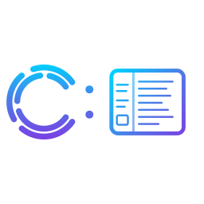

<p align="center">
  
</p>

<h4 align="center">AI tooling. Built for builders.</h4>

<p align="center">
  <a href="https://clagentic.ai"></a>
  <a href="LICENSE"></a>
  
  <a href="https://www.npmjs.com/package/@clagentic/console"></a>
  <a href="https://www.npmjs.com/package/@clagentic/console"></a>
  <a href="https://ko-fi.com/clagentic"></a>
</p>

A self-hosted browser console for Claude Code and ChatGPT Codex. Part of the [clagentic](https://clagentic.ai) suite. Run AI sessions from any browser or phone — tool approvals, model selection, context management, session history — without leaving your own machine.

No extras bolted on. No opinionated workflows. The floor is solid; you build what you need on top.

## Install

```bash
npm install -g @clagentic/console
```

Then run from anywhere:

```bash
clagentic-console
```

Or try it without installing:

```bash
npx @clagentic/console
```

**Requirements:** Node.js 20+. Authenticated Claude Code CLI, Codex CLI, or both.

## What it does

- **Browser access to your AI runtimes.** The goal is full parity with the CLI for both Claude Code and Codex — tool approvals, model selection, context management, session history. Most things work; see the FAQ for current gaps.
- **Named agent sessions (Claude Code).** Talk directly to any agent defined in your Claude Code config. Agents get their own sessions, context, and history. This feature is currently Claude Code only — see FAQ for details and what's planned for Codex.
- **Multi-project dashboard.** Every repo on your machine in one sidebar. Jump between projects, run sessions in parallel, see live status at a glance.
- **Mobile PWA + push notifications.** Installable on iOS and Android. Your phone buzzes when Claude needs approval or finishes a long task — tap to respond from anywhere.
- **Loop automation.** Write a `PROMPT.md`, hit go. Clagentic:Console iterates: run, evaluate, retry until done or capped. Schedule with standard cron.
- **Vendor flexibility.** Supports Claude Code (Claude Agent SDK) and ChatGPT Codex (codex app-server protocol). Switch per session.
- **Your data, your machine.** Sessions are JSONL, settings are JSON, knowledge is Markdown. No cloud relay, no proprietary database.

## Getting Started

On first run you'll be asked for a port and whether you're running solo or multi-user. Open the URL from any device on your network.

For remote access, use a tunnel — Tailscale, Cloudflare Tunnel, or your existing VPN.

## CLI Options

```bash
npx @clagentic/console              # Default (port 2633)
npx @clagentic/console -p 8080      # Specify port
npx @clagentic/console --yes        # Skip prompts, use defaults
npx @clagentic/console -y --pin 123456
npx @clagentic/console --add .      # Add current directory to running daemon
npx @clagentic/console --remove .   # Remove project
npx @clagentic/console --list       # List registered projects
npx @clagentic/console --shutdown   # Stop daemon
npx @clagentic/console --dangerously-skip-permissions
```

Also available as `clagentic-console` if installed globally.

## Architecture

Clagentic:Console is a self-hosted daemon. It drives Claude Code via the Claude Agent SDK and Codex via the `codex app-server` JSON-RPC protocol through a vendor-agnostic adapter layer (YOKE), and serves a multi-user web workspace over HTTP/WS. Sessions and settings live as plain JSONL/JSON/Markdown on disk.


For architecture details, sequence diagrams, and key design decisions, see [docs/guides/architecture.md](docs/guides/architecture.md).

## FAQ

**"Is this a Claude Code wrapper?"**
No. Clagentic:Console drives Claude Code through the Claude Agent SDK and Codex through the Codex app-server protocol. It adds multi-session orchestration, named agent sessions, scheduled agents, multi-user support, built-in MCP servers, and a full browser UI on top.

**"What are named agents?"**
Agents defined in your Claude Code config (`.claude/agents/`) become first-class sessions. You talk to them directly — their own conversation history, context window, and session state.

Named agents are **currently Claude Code only.** The Codex adapter has no equivalent API for per-session agent identity injection — the Claude Agent SDK exposes this directly, Codex does not. When you're in a Codex session, the Agent Chat entry point is hidden automatically. Partial Codex parity (system-prompt prepend) is planned; until then, agents only apply when the session vendor is Claude Code.

**"Is feature parity between Claude Code and Codex complete?"**
Not yet. The goal is full parity, but there are gaps. Named agents (above) are the main one. Claude Code has been the primary development target; Codex support covers sessions, tool approvals, model selection, MCP servers, loop, and most UI surfaces. Features that depend on Claude Agent SDK internals (agent identity, extended thinking, some beta flags) have no Codex equivalent today.

**"Can I run Claude Code and Codex in the same workspace?"**
Yes. Pick a vendor when you open a session. Switch per session — sessions remember their vendor.

**"Does my code leave my machine?"**
Only as model API calls — the same as using the CLI directly. Sessions, settings, and knowledge all stay on disk.

**"Does my existing CLAUDE.md / AGENTS.md work?"**
Yes. Native instruction files are loaded per vendor and merged automatically.

**"Can I continue a CLI session in the browser?"**
Yes. CLI sessions appear in the sidebar and can be picked up in the CLI.

**"Can I use it on my phone?"**
Yes. Install as a PWA on iOS or Android. Push notifications for approvals, errors, and task completion.

**"Does it work with MCP servers?"**
Yes. User-configured MCPs from `~/.clagentic/mcp.json` plus built-in ask-user and browser servers work in both Claude and Codex sessions.

**"Multi-user support?"**
Yes. On Linux, opt in to OS-level isolation: each user maps to a real Linux account, file ACLs via `setfacl`, processes spawn under the correct UID/GID.

## Support

If clagentic:console is useful to you: [ko-fi.com/clagentic](https://ko-fi.com/clagentic)

## Credits

Forked from [Clay](https://github.com/chadbyte/clay) by Chad, used under the MIT License.

## Disclaimer

Not affiliated with Anthropic or OpenAI. Claude is a trademark of Anthropic. Codex is a trademark of OpenAI. Provided "as is" without warranty. Users are responsible for complying with their AI provider's terms of service.

## License

[MIT](LICENSE)
