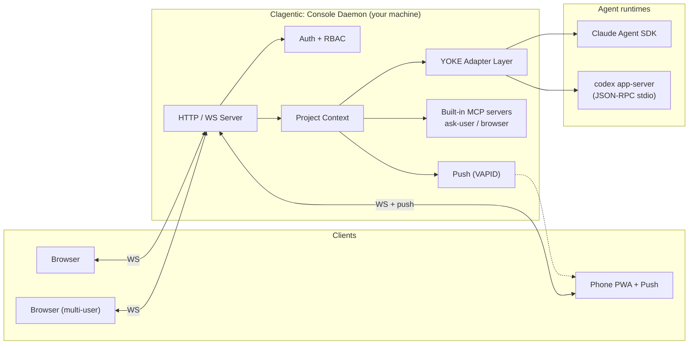

<p align="center">
  
</p>

<h4 align="center">AI tooling. Built for builders.</h4>

<p align="center">
  <a href="https://clagentic.ai"></a>
  <a href="LICENSE"></a>
  
  <a href="https://www.npmjs.com/package/@clagentic/console"></a>
  <a href="https://www.npmjs.com/package/@clagentic/console"></a>
  <a href="https://ko-fi.com/clagentic"></a>
</p>

A self-hosted control plane for your AI runtimes. Clagentic: Console runs as a daemon on your machine and serves a full browser and mobile interface to Claude Code and ChatGPT Codex. Every project, every session, every tool approval — reachable from any device, all data staying on disk.

## Install

```bash
npm install -g @clagentic/console
```

Then start the daemon:

```bash
clagentic-console
```

Or try without installing:

```bash
npx @clagentic/console
```

**Requirements:** Node.js 20+. Authenticated Claude Code CLI, Codex CLI, or both.

## What it does

- **Named agent sessions.** Type `@` in the session input to launch any agent defined in `.claude/agents/` or `~/.claude/agents/` into its own session — with its own conversation history, context window, and state. Pick agents by name, switch mid-conversation.

- **Context injection.** Pin running terminals, live browser tabs, and sticky notes as active context sources. Their content flows into every message automatically: terminal output as a delta since your last message, browser tabs as full snapshots. No manual copy-paste. No extra prompting.

- **Loop automation.** Write a `PROMPT.md`, start a loop. Clagentic: Console runs the prompt, evaluates the result, and retries until done or capped. Schedule loops with standard cron syntax to run unattended.

- **External triggers.** Drop a JSON file into `~/.clagentic/external-triggers/` to spawn a new AI session or inject a message into an existing one. Use this to wire Claude into scripts, CI pipelines, or other AI processes — no API, no polling, just a file drop.

- **Cross-vendor instruction injection.** YOKE (the vendor adapter layer) scans `CLAUDE.md`, `AGENTS.md`, `.cursorrules`, `COPILOT.md`, and `.github/copilot-instructions.md` and cross-injects whichever ones the active vendor doesn't read natively. Switch from Claude to Codex in a session — your project instructions still reach the model.

- **Multi-project dashboard.** Every repo registered with the daemon in one sidebar. Jump between projects, run sessions in parallel, see live status at a glance.

- **Mobile PWA + push notifications.** Installable on iOS and Android. Approve tool calls from your phone. Push fires on approval requests, errors, and task completion.

- **Multi-user with OS isolation.** On Linux, opt in: each user maps to a real system account, file ACLs via `setfacl`, processes spawn under the correct UID/GID.

- **Vendor flexibility.** Claude Code (Claude Agent SDK) and ChatGPT Codex (codex app-server protocol). Switch per session. Sessions remember their vendor.

- **MCP servers.** Built-in ask-user and browser servers. User-configured MCPs via `~/.clagentic/mcp.json`. Works in both Claude and Codex sessions.

- **Your data, your machine.** Sessions are JSONL, settings are JSON, knowledge is Markdown. No cloud relay, no proprietary database.

- **Clagentic: Lite (optional).** If [Clagentic: Lite](https://clagentic.ai/tools) is installed, project settings surface per-project enrollment controls and system settings add a global auto-enroll toggle. Console detects it passively — nothing changes if it isn't present.

## Getting Started

On first run you'll be asked for a port and prompted to create your admin account. Open the URL from any device on your network.

For remote access, use a tunnel — Tailscale, Cloudflare Tunnel, or your existing VPN.

## CLI Options

```bash
npx @clagentic/console              # Default (port 2633)
npx @clagentic/console -p 8080      # Specify port
npx @clagentic/console --yes        # Skip prompts, use defaults
npx @clagentic/console -y --pin 123456
npx @clagentic/console --add .      # Add current directory to running daemon
npx @clagentic/console --remove .   # Remove project
npx @clagentic/console --list       # List registered projects
npx @clagentic/console --shutdown   # Stop daemon
npx @clagentic/console --dangerously-skip-permissions
```

Also available as `clagentic-console` if installed globally.

## Architecture

Clagentic: Console is a self-hosted daemon. It drives Claude Code via the Claude Agent SDK and Codex via the `codex app-server` JSON-RPC protocol through a vendor-agnostic adapter layer (YOKE), and serves a multi-user web workspace over HTTP/WS. Sessions and settings live as plain JSONL/JSON/Markdown on disk.



For architecture details, sequence diagrams, and key design decisions, see [docs/guides/architecture.md](docs/guides/architecture.md).

## FAQ

**"Is this a Claude Code wrapper?"**
No. Clagentic: Console drives Claude Code through the Claude Agent SDK and Codex through the Codex app-server protocol. It adds multi-session orchestration, named agent sessions, scheduled agents, multi-user support, built-in MCP servers, context injection, external triggers, and a full browser UI on top.

**"What are named agents?"**
Agents defined in your Claude Code config (`.claude/agents/` or `~/.claude/agents/`) become first-class sessions. Type `@` in the session input to see every installed agent and launch one directly — its own conversation history, context window, and session state.

Named agents are **currently Claude Code only.** The Codex adapter has no equivalent API for per-session agent identity injection. When you're in a Codex session, the agent entry point is hidden. Partial Codex parity (system-prompt prepend) is planned.

**"How does context injection work?"**
Open the Context panel in the session input area. Pin a running terminal, a browser tab (requires the Clagentic: Console Chrome extension), or a sticky note. From that point on, every message you send automatically includes the latest content from those sources — terminal output as a delta since the last message, browser tabs as a full page snapshot. The injection happens before your message reaches the model; you don't need to mention the sources in your prompt.

**"What's the external trigger system?"**
Drop a JSON file into `~/.clagentic/external-triggers/`. The daemon picks it up within seconds. A v1 trigger spawns a new session with an `initialPrompt`. A v2 trigger can either spawn a session or inject a message into an existing session by `sessionId`. The file is archived to `processed/` on success. Unprocessed files survive daemon restarts. Use this to wire Claude into scripts, CI pipelines, cron jobs, or other AI processes.

**"What instruction files does it read?"**
YOKE scans the project directory for `CLAUDE.md`, `AGENTS.md`, `.cursorrules`, `COPILOT.md`, and `.github/copilot-instructions.md`. Each vendor reads some of these natively — Claude reads `CLAUDE.md`, Codex reads `AGENTS.md`. Files the active vendor doesn't read natively are merged and injected as additional context, so your project instructions reach the model regardless of which vendor is running.

**"Is feature parity between Claude Code and Codex complete?"**
Not yet. Named agents are the main gap — the Claude Agent SDK exposes agent identity injection directly; Codex does not. Claude Code has been the primary development target. Codex support covers sessions, tool approvals, model selection, MCP servers, loop, and most UI surfaces. Features that depend on Claude Agent SDK internals have no Codex equivalent today.

**"Can I run Claude Code and Codex in the same workspace?"**
Yes. Pick a vendor when you open a session. Switch per session — sessions remember their vendor.

**"Does my code leave my machine?"**
Only as model API calls — the same as using the CLI directly. Sessions, settings, and knowledge all stay on disk.

**"Does my existing CLAUDE.md / AGENTS.md work?"**
Yes. Native instruction files are loaded per vendor and merged automatically. Non-native files are cross-injected by YOKE.

**"Can I continue a CLI session in the browser?"**
Yes. CLI sessions appear in the sidebar and can be picked up in the CLI.

**"Can I use it on my phone?"**
Yes. Install as a PWA on iOS or Android. Push notifications for approvals, errors, and task completion.

**"Does it work with MCP servers?"**
Yes. User-configured MCPs from `~/.clagentic/mcp.json` plus built-in ask-user and browser servers work in both Claude and Codex sessions.

**"Multi-user support?"**
Yes. On Linux, opt in to OS-level isolation: each user maps to a real Linux account, file ACLs via `setfacl`, processes spawn under the correct UID/GID.

**"Does it integrate with Clagentic: Lite?"**
Yes, optionally. [Clagentic: Lite](https://clagentic.ai/tools) adds agentic gates, session memory, and audit trails to any repo. If Lite is installed (`~/.clagentic/lite/`), Console detects it automatically and shows an enrollment panel in each project's settings. Enable auto-enroll in system settings to wire up every project on add. Lite is never required — Console works normally without it.

## Support

If Clagentic: Console is useful to you: [ko-fi.com/clagentic](https://ko-fi.com/clagentic)

## Credits

Forked from [Clay](https://github.com/chadbyte/clay) by Chad, used under the MIT License.

## Disclaimer

Not affiliated with Anthropic or OpenAI. Claude is a trademark of Anthropic. Codex is a trademark of OpenAI. Provided "as is" without warranty. Users are responsible for complying with their AI provider's terms of service.

## License

[MIT](LICENSE)
