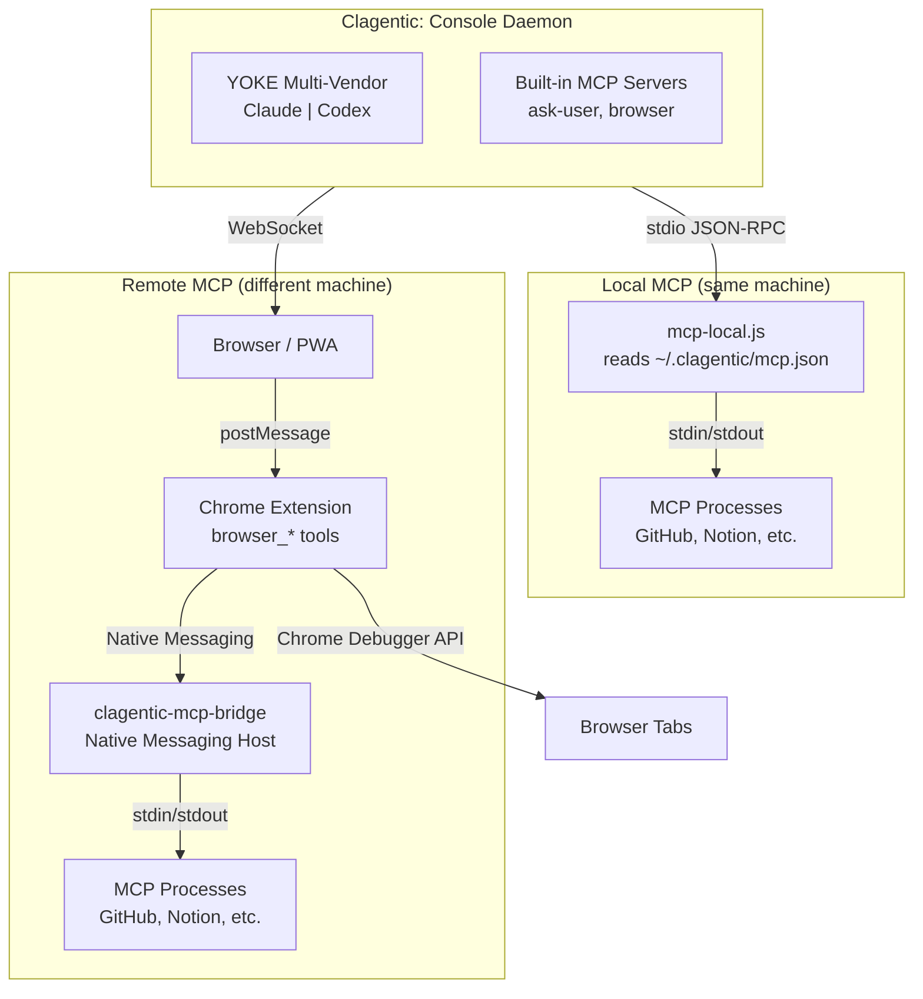

# Clagentic: Console Ecosystem

> Repositories, their roles, and how they connect.

---

## Project Registry

| Repo | Type | Description |
|------|------|-------------|
| **clagentic-console** | Core | Main server, daemon, webapp, SDK bridge, YOKE multi-vendor adapter |
| **clagentic-lite** | Optional companion | Agentic gates, session memory, and audit trails for any repo. Console detects it automatically when installed. |
| **clagentic-chrome** | Extension | Chrome/Arc extension for browser automation and MCP relay (lr-ead6: fork vs keep clay-chrome compatibility) |

---

## Architecture

---

## Connection Paths

### Local user (same machine as daemon)

No extension or bridge needed. `mcp-local.js` reads `~/.clagentic/mcp.json` directly.

### Remote user (browser on different machine)

Requires Chrome extension + `clagentic-mcp-bridge` native host installed on the user's machine. See `native-host/install.sh`.

---

## Vendor Support (YOKE)

| Vendor | Adapter | MCP Support |
|--------|---------|-------------|
| Claude | `yoke/adapters/claude.js` | Full (in-process SDK MCP servers) |
| Codex | `yoke/adapters/codex.js` | Via stdio MCP bridge (see CODEX-INTEGRATION.md) |

---

## Clagentic: Lite Integration

Console integrates with [Clagentic: Lite](https://clagentic.ai) as an optional companion. When Lite is installed, Console surfaces enrollment controls without requiring any manual configuration.

**Detection** (`lib/lite-detect.js`):
- Lite is considered installed if `~/.clagentic/lite/` exists (or `$CLAGENTIC_HOME`) and the `clagentic-lite` binary is on PATH
- Per-project enrollment status: presence of `<projectDir>/.clagentic/lite/audit.db`

**Console surfaces:**
- **Project settings** — enroll/unenroll the active project via `clagentic-lite enroll|unenroll <path>`
- **System settings** — `liteAutoEnroll` toggle: when on, Console auto-enrolls every project when it is added to the daemon

**Nothing changes** if Lite is not installed — detection is passive, all UI sections are hidden.

**Enrollment data location:** `.clagentic/lite/` inside each enrolled project directory (not committed by default — add to `.gitignore` if desired).

---

## Key Config Files

| File | Purpose |
|------|---------|
| `~/.clagentic/mcp.json` | MCP server definitions (command, args, env) + include list |
| `~/.clagentic/daemon.json` | Project list, per-project settings, `liteAutoEnroll` flag |
| `~/.clagentic/lite/` | Clagentic: Lite home directory (when installed) |
| `~/.codex/config.toml` | Codex CLI configuration |
| `~/.claude/settings.json` | Claude Code settings |

---

## Cross-repo References

When modifying MCP message flow, these files must stay in sync:

| Message | clagentic-console (server) | chrome extension | mcp-bridge (host) |
|---------|---------------------------|------------------|-------------------|
| Tool call | `project-mcp.js` createToolHandler | `background.js` mcpRelayToolCall | `clagentic-mcp-host.js` relayToolCall |
| Tool result | `project-mcp.js` handleToolResult | `background.js` mcpHandleNativeMessage | `clagentic-mcp-host.js` handleMcpResponse |
| Server list | `project-mcp.js` handleServersAvailable | `background.js` broadcastMcpServers | `clagentic-mcp-host.js` getServers |

See [MCP-IMPLEMENTATION.md](./MCP-IMPLEMENTATION.md) for detailed message flow diagrams.
