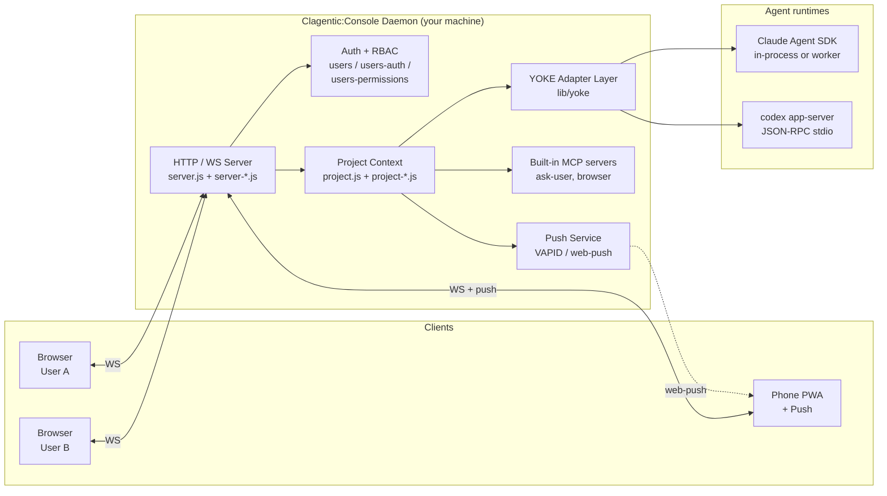
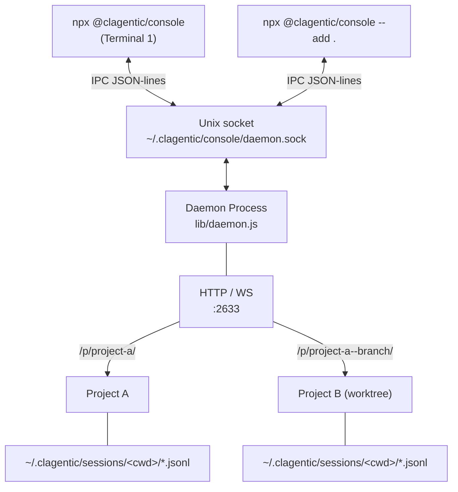
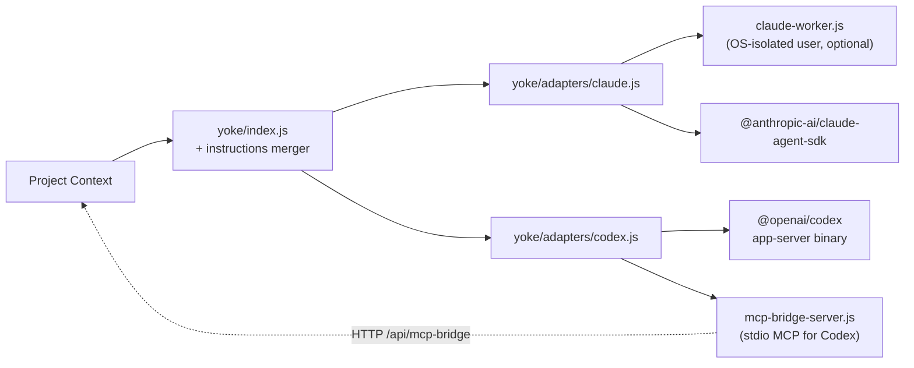
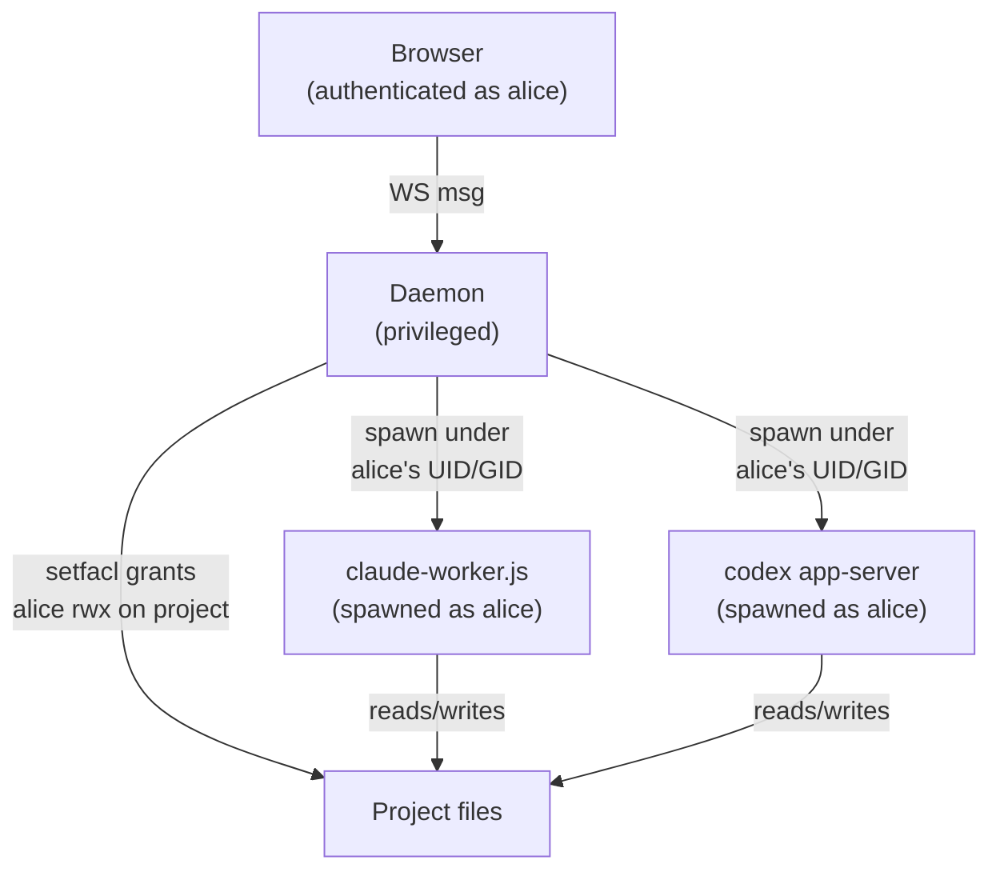
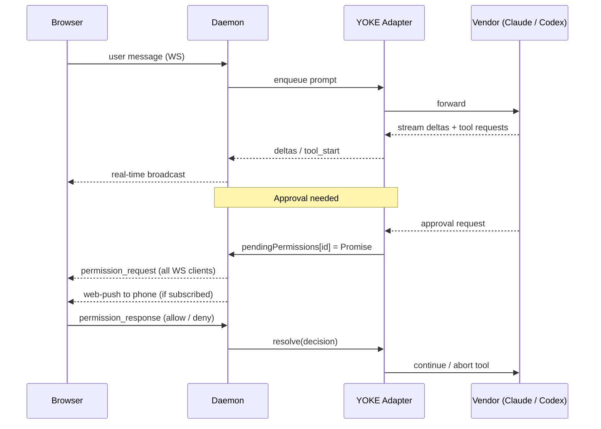

# Architecture

Clagentic:Console is not a CLI wrapper. It is a self-hosted daemon that drives **Claude Code** (via the [Claude Agent SDK](https://www.npmjs.com/package/@anthropic-ai/claude-agent-sdk)) and **Codex** (via the `codex app-server` JSON-RPC protocol) through a vendor-agnostic adapter layer (**YOKE**), and serves a multi-user web workspace over HTTP/WS.

Everything runs on your machine. Sessions and settings live as plain JSONL/Markdown on disk. No cloud relay, no proprietary database.

## System Overview



## CLI ↔ Daemon

Clagentic:Console decouples the CLI from the long-running server. The CLI starts (or attaches to) a detached daemon over a Unix domain socket.



The daemon is spawned with `detached: true` and survives CLI exit. Multiple CLI instances share one daemon. IPC commands include `add_project`, `remove_project`, `set_pin`, `set_keep_awake`, `shutdown`, `get_status`.

## YOKE Adapter Layer

YOKE (Yoke Overrides Known Engines) is the vendor abstraction. Each adapter implements the same contract (`init`, `createQuery`, etc.), so `project.js` never has to know which agent runtime is driving a session.



**Cross-vendor instruction merging.** On every `createQuery`, YOKE scans the project for instruction files (`CLAUDE.md`, `AGENTS.md`, `.cursorrules`, …), drops the ones the current vendor reads natively, and merges the rest into `systemPrompt`. The result: a Codex session sees `CLAUDE.md` content, a Claude session sees `AGENTS.md` content. Switching vendors does not break project context.

**Codex specifics.** Codex talks to the daemon via JSON-RPC 2.0 over its app-server's stdin/stdout (`yoke/codex-app-server.js`). Approval events, skill injection, and MCP tool calls travel as RPC messages. Built-in tools that Codex needs (ask-user, browser) are exposed through a stdio MCP bridge (`yoke/mcp-bridge-server.js`) that proxies to the daemon over HTTP.

For deeper Codex integration patterns and gotchas, see [CODEX-INTEGRATION.md](./CODEX-INTEGRATION.md).

## Multi-User and OS-Level Isolation

Clagentic:Console supports two modes:

- **Single-user.** PIN auth, all sessions run as the daemon's UID.
- **Multi-user.** Each user has an account, optional invites, OTP, RBAC permissions, and (on Linux) an OS-level Linux account.

When OS-level isolation is enabled on Linux:



`os-users.js` is the shared utility. It validates Linux usernames, resolves UID/GID via `getent passwd`, runs filesystem operations as the target user via a helper subprocess, and grants ACL access via `setfacl`. The kernel enforces isolation: one user's agent cannot read another user's project files even if the application code has a bug.

User provisioning lives in `daemon.js` (`provisionLinuxUser`, `grantProjectAccess`). All worker spawns route through `os-users.resolveOsUserInfo`.

## Permission Flow

Every tool call goes through a vendor-neutral approval gate.



`project-sessions.js` owns `permission_response`. `project-notifications.js` formats the alarm and may also fire push.

## Session Storage

Sessions live at `~/.clagentic/sessions/{encoded-cwd}/{cliSessionId}.jsonl`, one JSONL line per event:

```
{"type":"meta","localId":1,"cliSessionId":"...","title":"...","createdAt":...,"vendor":"claude"}
{"type":"user_message","text":"..."}
{"type":"delta","text":"..."}
{"type":"tool_start","id":"...","name":"..."}
...
```

Append-only. At most the last line is lost on a crash. The daemon replays all session files on restart.

Settings are JSON in `~/.clagentic/`. User-configured MCP servers live in `~/.clagentic/mcp.json`.

## Multi-Project Routing

```
/                    → Dashboard (auto-redirect if only one project)
/p/{slug}/           → Project UI
/p/{slug}/ws         → Project WebSocket
/p/{slug}/api/...    → Project HTTP (push subscribe, file access, image, …)
/p/{parent}--{branch}/ → Worktree (auto-detected child of parent project)
```

Slugs are auto-generated from the directory name. Duplicates get `-2`, `-3`, etc. Worktrees are scanned by the parent slug (`daemon-projects.js`) and registered with a `parent--branch` slug pattern.

## Built-in MCP Servers

| Server | File | Provides |
|---|---|---|
| `browser` | `browser-mcp-server.js` | Open / navigate / click / screenshot / extract via the user's connected browser |

User-defined MCP servers from `~/.clagentic/mcp.json` are loaded on top.

For Codex sessions, built-in MCPs are exposed through a stdio bridge (`yoke/mcp-bridge-server.js`), which proxies tool list / call back to the daemon over HTTP at `/api/mcp-bridge`.

For deeper MCP details, see [MCP-IMPLEMENTATION.md](./MCP-IMPLEMENTATION.md).

## Push Notifications

`push.js` generates a VAPID key pair on first run (`~/.clagentic/vapid.json`, mode 600) and uses `web-push` for delivery. Subscriptions are stored per-user.

Push fires on:
- Permission requests
- Task completion / errors
- @mentions of the user (only when the user has no live WS connection)

The service worker (`lib/public/sw.js`) handles incoming pushes and routes the user back to the right session on tap.

## Key Design Decisions

| Decision | Rationale |
|---|---|
| Unix socket IPC | CLI ↔ daemon without burning an extra TCP port |
| Detached daemon | Server outlives the CLI; sessions keep running after `exit` |
| JSONL session storage | Append-only, crash-friendly, `cat`/`grep`-friendly |
| Vendor adapters under YOKE | Adding a new agent runtime is an adapter, not a refactor |
| Cross-vendor instruction merge | Switching Claude ↔ Codex doesn't lose project context |
| Codex via JSON-RPC stdio | Approval events and skills need real-time RPC, not exec mode |
| OS-level isolation (Linux) | Trust the kernel for user separation, not application code |
| Slug-based routing | Many projects, one port, predictable URLs |
| `0.0.0.0` + PIN | LAN access by default; use a tunnel for remote |

## Memory Limits (Linux / systemd)

The shipped `deploy/clagentic-console.service` unit carries percentage-based cgroup limits as a **documentation-only fallback**:

```
MemoryHigh=70%   # soft ceiling — kernel begins reclaiming early
MemoryMax=85%    # hard ceiling — triggers per-service OOM (systemd kills and restarts)
OOMPolicy=kill   # kill all cgroup members on OOM; systemd Restart=always handles the restart
```

**Never trust a systemd `%` memory directive inside a container (lr-c10f6d).** systemd resolves `MemoryHigh=70%` / `MemoryMax=85%` against the cgroup-visible MemTotal at the layer it runs — inside an LXC container that is the **host's** RAM, not the container's. Only userspace (via lxcfs) sees the container-true `/proc/meminfo`. On a 12G container behind a ~28G host, the applied cgroup ceiling silently resolved to `high=19.8G max=24.0G` — a "last line of defense" (OOMPolicy=kill) that could never fire before the kernel's host-level OOM killer wedged the whole box.

### Computed absolute defaults (lr-c10f6d)

Because of the above, the installer never relies on the unit file's `%` lines. On every `npm install -g @clagentic/console` (root required), `scripts/postinstall.js` (via `lib/memory-limits.js`) reads `/proc/meminfo` MemTotal directly in userspace and writes a systemd drop-in at `/etc/systemd/system/clagentic-console.service.d/memory-overrides.conf` with **absolute byte values**:

```
MemoryHigh = floor(60% of MemTotal)
MemoryMax  = floor(75% of MemTotal)
```

This is recomputed and rewritten unconditionally on every postinstall, so it tracks RAM changes without any operator action — reinstalling after a RAM upgrade is sufficient (no manual edit needed, unlike a stale absolute pin).

### Optional daemon.json overrides (lr-de07)

Operators who need to pin explicit byte or percentage values can add `memoryHigh` and/or `memoryMax` to `~/.clagentic/console/daemon.json`. An explicit override always takes precedence over the computed default above.

```json
{
  "memoryHigh": "6G",
  "memoryMax":  "8G"
}
```

Accepted formats: `NNN%` (whole number, 1–100) or `NG` / `NM` / `NK` / bare bytes. Note that a `%` value here resolves through the same systemd `%`-inside-a-container caveat as the shipped unit file — prefer an absolute value (`NG`/`NM`) for any container deployment.

**If you pinned an absolute override and added RAM:** update `memoryHigh` / `memoryMax` in `daemon.json` and re-run `npm install -g @clagentic/console` as root (or write the drop-in manually and run `systemctl daemon-reload`).

### Startup applied-ceiling sanity check (lr-c10f6d)

On every Linux startup, the daemon compares the *applied* cgroup `memory.max` (read from `/sys/fs/cgroup/system.slice/clagentic-console.service/memory.max`) against `/proc/meminfo` MemTotal. If the applied ceiling is `max` (unset) or `>=` the container's true RAM, the daemon emits a structured stderr WARN (`event: memory_ceiling_inoperative`, captured by journald) and a UI toast diagnostic ("memory ceiling exceeds container RAM — OOM protection inoperative"). This turns a silent miscalibration — the exact failure mode that caused this task — into a visible fault on any future host, even if the drop-in is stale, hand-edited, or was never applied.

### Bounded in-heap session history (lr-2ea2a7)

On-disk JSONL is the single source of truth for full session history. The in-heap `session.history` array is always a bounded TAIL window — for every session, including one that is actively processing (a long-running Ralph/crew loop). Prior to lr-2ea2a7, a session's `isProcessing` state exempted it from LRU eviction (`lib/sessions.js`) with no other cap on its heap history, so a multi-hour loop accumulated its entire event stream in memory — the root cause of repeated daemon OOM incidents.

Every append to `session.history` routes through `recordHistoryEntry()` (`lib/sessions.js`), which enforces `HISTORY_INMEM_MAX` (default 1000 entries) with hysteresis down to `HISTORY_INMEM_TRIM_TO` (default 800): once the heap array exceeds the cap, the oldest entries are trimmed and `session._historyBaseIndex` advances by the trimmed count. Absolute index (`_historyBaseIndex + heapOffset`) remains the wire/UI contract (`history_meta.total/from`, `load_more_history.before`, `messageUUIDs[].historyIndex`) — no wire-format change.

Operators can override the cap via `~/.clagentic/console/daemon.json`:

```json
{
  "historyInMemMax": 2000
}
```

`process_stats` (admin panel) reports per-session `{heapEntries, baseIndex}` and the top 5 sessions by heap footprint for diagnosing memory pressure without a heap snapshot.

**If you pinned an absolute override and added RAM:** update `memoryHigh` / `memoryMax` in `daemon.json` and re-run `npm install -g @clagentic/console` as root (or write the drop-in manually and run `systemctl daemon-reload`). Operators using the default percentage values need not do anything.

### MemoryHigh watermark log (lr-de07)

The daemon polls for MemoryHigh crossings (every 5 s) using either the cgroup v2 `memory.events high` counter (preferred) or process RSS vs. the resolved threshold (fallback). When a crossing is detected, a single structured log event is emitted to stderr (captured by journald):

```
[memory-limits] WARN memory_high_watermark {"event":"memory_high_watermark","source":"cgroup.memory.events","timestamp":"...","highCounter":1}
```

This signal feeds two independent consumers of `onCrossing` (`lib/daemon.js`), both wired to the same watermark crossing:

- **Graceful drain (lr-6b30, `lib/drain.js`)** — refuses new connections and exits once in-flight sessions complete (or a timeout forces exit). The "make the daemon go away" response.
- **In-process shedding (lr-5e70, `lib/memory-shed.js`)** — an immediate attempt to reduce RSS *before* drain's slower shutdown path completes. Runs first, synchronously, inside the same `onCrossing` callback.

### In-process memory shedding (lr-5e70)

`shedMemory()` (`lib/memory-shed.js`) runs a shedding pass across every open project (`relay.forEachProject`, `lib/server.js`):

1. **Retrim every loaded session's history** to `HISTORY_INMEM_TRIM_TO` via `sm.retrimHistory()` — including the actively-viewed and `isProcessing` sessions, which the lr-2ea2a7 bounded-tail cap makes safe to trim unconditionally (disk remains the full source of truth; a later `load_more_history` scroll-up still serves older content from disk).
2. **Force-evict loaded sessions beyond the normal LRU limit** down to a pressure limit (`LRU_HISTORY_LIMIT / 2`) via `sm.forceEvictToLimit()` (`lib/sessions.js`) — more aggressive than the routine one-at-a-time post-load eviction (`_lruEvictIfNeeded`), since a shedding pass may need to unload many sessions at once. Still never evicts the actively-viewed session or an `isProcessing` session — same invariant as the routine LRU path.
3. **Drop rebuildable caches.** Currently: `lib/server-skills.js`'s `skillsCache` (TTL-cached skills.sh proxy responses — any dropped entry just re-fetches on next request). Other module-level caches surveyed during this task (`lib/pages.js` template cache, `lib/daemon-projects.js` worktree registries, `lib/smtp.js` OTP store, `lib/store.js` queues, `lib/user-presence.js` presence store) were left alone: each holds state that is either short-lived by design or not safely re-derivable without a live client round-trip, unlike the skills proxy cache.
4. **Emit a UI diagnostic** (`type: "diagnostic", source: "memory"`) to every project's connected clients — the same session-independent `ctx.send()` delivery path settings-preflight diagnostics already use — with before/after RSS and counts of what was shed, so operators see pressure in the Diagnostics panel, not just journald.
5. **Emit a structured `memory_shed` log event** to stderr (`beforeBytes`, `afterBytes`, `sessionsTrimmed`, `sessionsEvicted`, `cachesDropped`).
6. **Rate-limited to at most one pass per 60 s** — the watermark watcher's RSS-based strategy B can re-fire on hysteresis, and a shedding pass should not run back-to-back.

Shedding and drain are independent: a shedding pass that fails, throws, or is rate-limited never blocks drain from entering, and drain entering never skips a shedding attempt.

### Post-hardening consolidation audit (lr-b6fa)

Fourth and final leg of the OOM-hardening chain (lr-2ea2a7 -> lr-c10f6d -> lr-5e70 -> lr-b6fa): an audit of every lazy-load/LRU/pagination mechanism added since the Clay fork, checking whether the bounded-history hardening above superseded any of it. Verdicts, one line each:

- **Lazy history load, tail-window replay, scroll-up pagination** (`loadSessionHistory`, `replayHistory`, `load_more_history`) — KEEP (operator directive): fixes full-history scroll on resume, load-bearing for memory; Fix A bounds it, does not replace it.
- **`findLastTurnStart` / `findTurnBoundary` / `extendWindowForVisibility`** (lr-c24b yield guarantees) — KEEP: boundary math re-verified against `_historyBaseIndex` translation post-Fix-A (`load_more_history` in `lib/project-sessions.js` correctly branches heap-relative vs. disk-absolute around `baseIndex`); still the only mechanism preventing all-invisible-yield pages.
- **`_historyPersistedLength` / `historyMatchesDisk`** (lr-f940 N1) — KEEP: Fix A redefined the counter as an absolute on-disk count instead of heap length, but the single-helper length-mismatch invariant (rewind trim, fork wholesale assign) is exactly what the lr-f940 regression suite (`test/session-meta-only-save-loaded-lr-f940.test.js`) still asserts; no simplification found that preserves the guarantee.
- **`LRU_HISTORY_LIMIT` (=50) session-count budget** — KEEP, number unchanged: worst case is now bounded (50 x `HISTORY_INMEM_MAX` instead of unbounded), and lr-5e70's `forceEvictToLimit()` added a second live consumer (`PRESSURE_LRU_FRACTION` halves it under memory pressure) — the budget is more load-bearing after Fix C than before, not less.
- **Sticky-bottom quiet-window timer chain + ResizeObserver** (`lib/public/modules/app-rendering.js`) — KEEP: frontend UI concern, not memory/heap machinery; already minimal (one container-level observer, two timers) after a documented earlier fix for a per-child-observer callback storm; nothing in the Fix A/B/C chain touches it.
- **Search paths** (`searchSessions`, `searchSessionContent`) — already cut by Fix A itself: both stream `readSessionHistoryFromDisk()` with zero heap/LRU retention; audited for residue of the pre-Fix-A `loadSessionHistory()`-based implementation and found none.

No code deletions resulted from this pass — every candidate is either already-consolidated (search paths, eviction helper de-duplication) or independently justified as still load-bearing. Two gaps outside this audit's no-behavior-change scope were surfaced and left for lr-efd60f: `/api/palette/search` (`lib/server-palette.js` -> `lib/session-search.js`) reads `session.history` without a `loadSessionHistory()` call, so palette search is silently incomplete for lazy/unloaded sessions; and `session.messageUUIDs` is never trimmed or cleared on LRU eviction (unlike `session.history`), so it can hold a full-conversation array in heap indefinitely for a session that gets reloaded and evicted repeatedly.

## Context meter (lr-3af675)

The context-window meter (header bar, context panel, popover, and the
Plan-approval "Clear context" label) is **vendor-first**: it never derives a
context-window size from a model name. Each provider reports its own window,
and that report is the only source ever trusted.

- **Claude.** `modelUsage.contextWindow` (sent on every `result` message) and
  `getContextUsage()`'s `maxTokens` (the SDK's own rich breakdown, fetched
  fire-and-forget at the end of a turn — see `lib/sdk-message-processor.js`)
  are both vendor-reported and already reflect any active beta (e.g.
  `context-1m`).
- **Codex.** The app-server does not currently expose a per-turn context
  window on this path, so the meter renders the indeterminate state for
  Codex sessions. Consuming Codex's `turn/started` `model_context_window` is
  tracked separately (lr-872f94), not solved here.

`lib/public/modules/app-panels.js`'s `resolveContextWindow(vendorWindow)` is
a pure validator — it returns the vendor value unchanged when it is a
positive number, and `0` ("unknown") otherwise. There is no fallback table
and no guessed default: **a resumed session before its first completed turn,
or a daemon restart, is expected to show a blank/indeterminate meter, not a
fabricated `0 / 200K · 0%`.** `getEffectiveContextFill()` is the single
`{used, win}` pair every meter surface reads from, so the header bar,
context panel, popover, and the `tools.js` clear-context label can never
disagree with each other.

Context fill counts all three of Anthropic's (disjoint) usage fields —
`input_tokens`, `cache_read_input_tokens`, and `cache_creation_input_tokens`
— since all three occupy the window; omitting `cache_creation_input_tokens`
under-reports fill on cache-write-heavy turns.

On compaction, the daemon re-reads vendor usage and pushes a fresh
`context_usage` message the moment the provider reports the turn as no
longer compacting (see the `status` handler in
`lib/sdk-message-processor.js`) — the meter does not wait for the next
turn's `result` event to reflect the provider's post-compaction accounting.

## Custom emoji icons (lr-a68f)

Projects can use uploaded images as icons instead of Unicode emoji. The icon value stored in `config.projects[].icon` is a `:slug:` sentinel string (pattern `^:[a-z0-9_-]{1,64}:$`) when a custom image is selected.

### Server routes (`lib/server-settings.js`)

| Method | Path | Auth | Description |
|---|---|---|---|
| `GET` | `/api/custom-emoji` | none | List all uploads: `[{slug, url}]` |
| `POST` | `/api/custom-emoji/:slug` | required | Upload image (PNG/JPEG/GIF/WebP, max 512 KB) |
| `GET` | `/api/custom-emoji/:slug` | none | Serve image bytes with immutable `Cache-Control` |
| `DELETE` | `/api/custom-emoji/:slug` | required | Remove an uploaded image |

All routes validate the slug against `/^[a-z0-9_-]{1,64}$/` before any filesystem operation. The POST handler uses magic-byte detection (same pattern as the avatar handler) to determine the file extension; `safePath()` is used as defence-in-depth on GET and DELETE where the file already exists.

### Storage

`CONFIG_DIR/custom-emoji/{slug}.{ext}` where `CONFIG_DIR = ~/.clagentic/console/` (migrated path per lr-12d0). Files are written with `0o644` permissions.

### Frontend render path (`lib/public/modules/project-icon.js`)

`renderProjectIcon(iconStr, el, parseEmojisFn)` is the single shared helper. It:

- Calls `isCustomIcon(iconStr)` (tests `^:[a-z0-9_-]{1,64}:$`).
- If true: creates `` via DOM API (no innerHTML).
- Otherwise: sets `el.textContent = iconStr` and calls `parseEmojisFn(el)`.

The helper is wired into every icon render site: `sidebar-projects.js`, `app-home-hub.js`, `project-settings.js`, `sidebar-mobile.js`, `project-switcher.js`, and `app-projects.js` (title bar + input indicator).

### XSS fix

`app-home-hub.js` previously interpolated `proj.icon` directly into `innerHTML`. That site now uses DOM API with `renderProjectIcon`, eliminating the stored-XSS vector.

## See Also

- [MODULE_MAP.md](./MODULE_MAP.md) — where every module lives and what it owns
- [CODEX-INTEGRATION.md](./CODEX-INTEGRATION.md) — Codex-specific patterns and gotchas
- [MCP-IMPLEMENTATION.md](./MCP-IMPLEMENTATION.md) — MCP server architecture (local + bridged)
- [NO-GOD-OBJECTS.md](./NO-GOD-OBJECTS.md) — module size principles
- [STATE_CONVENTIONS.md](./STATE_CONVENTIONS.md) — state management rules
