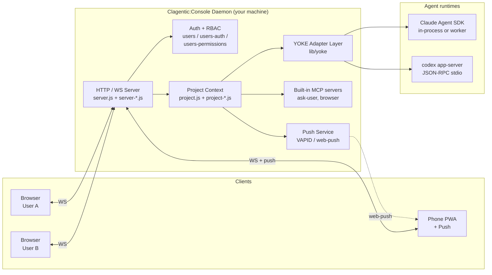
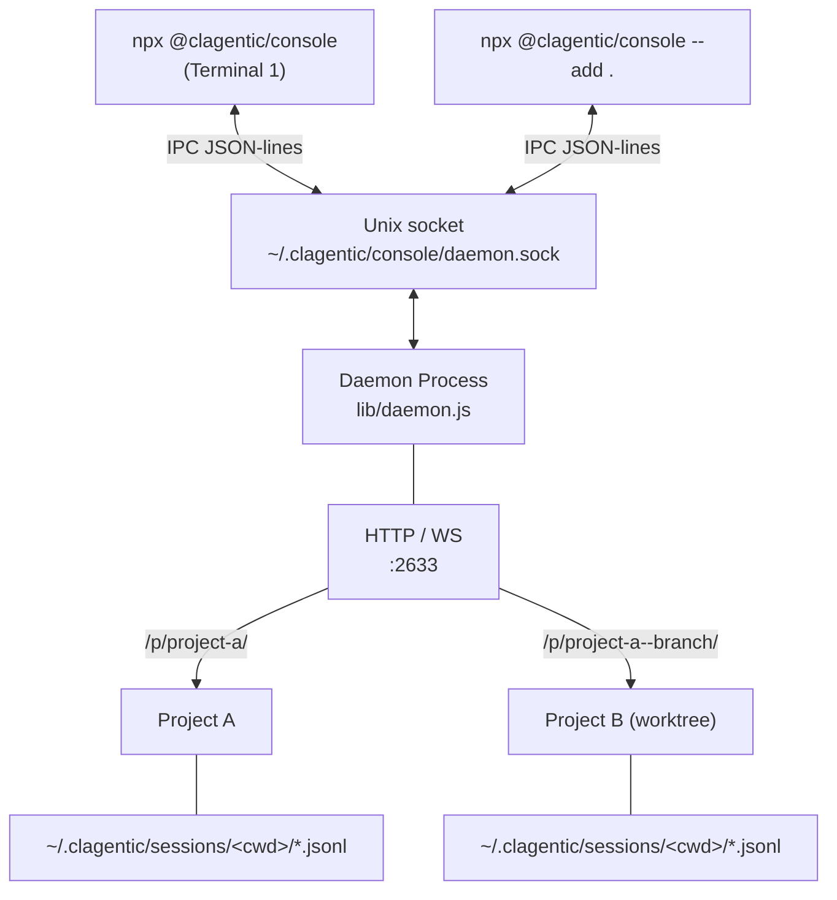
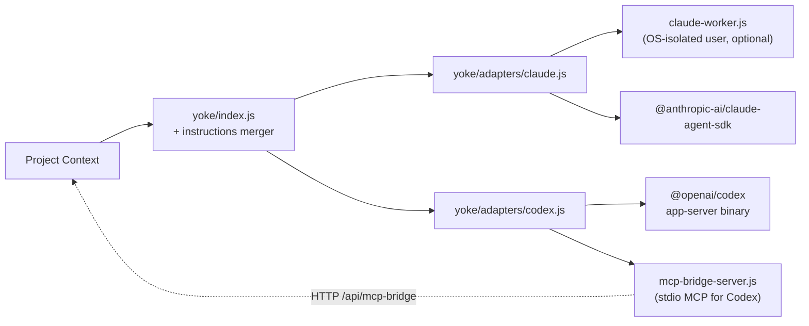
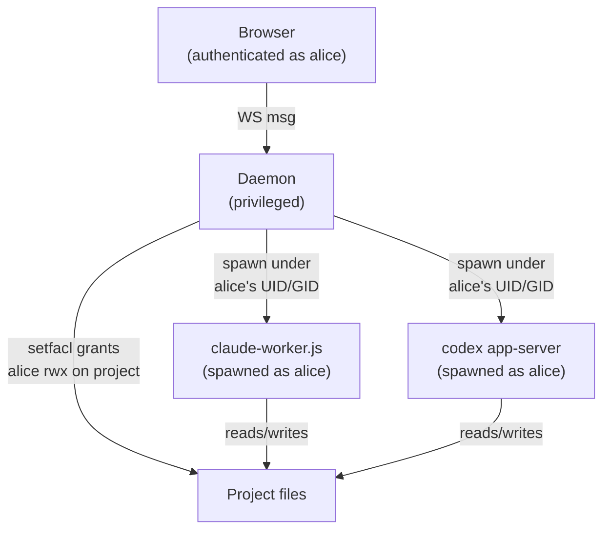
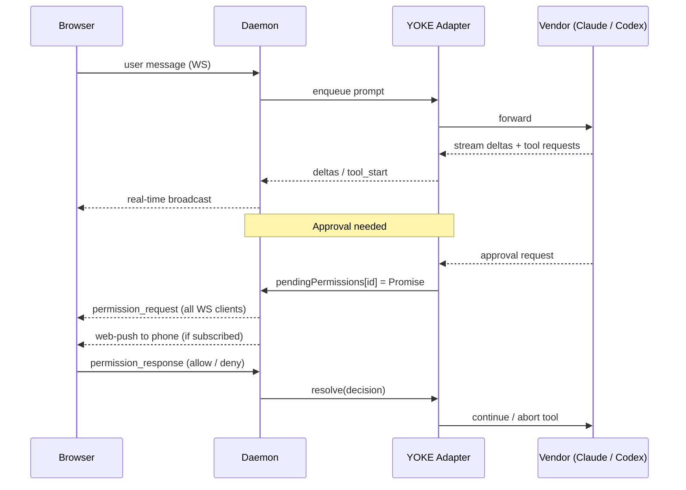

# Architecture

Clagentic:Console is not a CLI wrapper. It is a self-hosted daemon that drives **Claude Code** (via the [Claude Agent SDK](https://www.npmjs.com/package/@anthropic-ai/claude-agent-sdk)) and **Codex** (via the `codex app-server` JSON-RPC protocol) through a vendor-agnostic adapter layer (**YOKE**), and serves a multi-user web workspace over HTTP/WS.

Everything runs on your machine. Sessions and settings live as plain JSONL/Markdown on disk. No cloud relay, no proprietary database.

## System Overview



## CLI ↔ Daemon

Clagentic:Console decouples the CLI from the long-running server. The CLI starts (or attaches to) a detached daemon over a Unix domain socket.



The daemon is spawned with `detached: true` and survives CLI exit. Multiple CLI instances share one daemon. IPC commands include `add_project`, `remove_project`, `set_pin`, `set_keep_awake`, `shutdown`, `get_status`.

## YOKE Adapter Layer

YOKE (Yoke Overrides Known Engines) is the vendor abstraction. Each adapter implements the same contract (`init`, `createQuery`, etc.), so `project.js` never has to know which agent runtime is driving a session.



**Cross-vendor instruction merging.** On every `createQuery`, YOKE scans the project for instruction files (`CLAUDE.md`, `AGENTS.md`, `.cursorrules`, …), drops the ones the current vendor reads natively, and merges the rest into `systemPrompt`. The result: a Codex session sees `CLAUDE.md` content, a Claude session sees `AGENTS.md` content. Switching vendors does not break project context.

**Codex specifics.** Codex talks to the daemon via JSON-RPC 2.0 over its app-server's stdin/stdout (`yoke/codex-app-server.js`). Approval events, skill injection, and MCP tool calls travel as RPC messages. Built-in tools that Codex needs (ask-user, browser) are exposed through a stdio MCP bridge (`yoke/mcp-bridge-server.js`) that proxies to the daemon over HTTP.

For deeper Codex integration patterns and gotchas, see [CODEX-INTEGRATION.md](./CODEX-INTEGRATION.md).

## Multi-User and OS-Level Isolation

Clagentic:Console supports two modes:

- **Single-user.** PIN auth, all sessions run as the daemon's UID.
- **Multi-user.** Each user has an account, optional invites, OTP, RBAC permissions, and (on Linux) an OS-level Linux account.

When OS-level isolation is enabled on Linux:



`os-users.js` is the shared utility. It validates Linux usernames, resolves UID/GID via `getent passwd`, runs filesystem operations as the target user via a helper subprocess, and grants ACL access via `setfacl`. The kernel enforces isolation: one user's agent cannot read another user's project files even if the application code has a bug.

User provisioning lives in `daemon.js` (`provisionLinuxUser`, `grantProjectAccess`). All worker spawns route through `os-users.resolveOsUserInfo`.

## Permission Flow

Every tool call goes through a vendor-neutral approval gate.



`project-sessions.js` owns `permission_response`. `project-notifications.js` formats the alarm and may also fire push.

## Session Storage

Sessions live at `~/.clagentic/sessions/{encoded-cwd}/{cliSessionId}.jsonl`, one JSONL line per event:

```
{"type":"meta","localId":1,"cliSessionId":"...","title":"...","createdAt":...,"vendor":"claude"}
{"type":"user_message","text":"..."}
{"type":"delta","text":"..."}
{"type":"tool_start","id":"...","name":"..."}
...
```

Append-only. At most the last line is lost on a crash. The daemon replays all session files on restart.

Settings are JSON in `~/.clagentic/`. User-configured MCP servers live in `~/.clagentic/mcp.json`.

## Multi-Project Routing

```
/                    → Dashboard (auto-redirect if only one project)
/p/{slug}/           → Project UI
/p/{slug}/ws         → Project WebSocket
/p/{slug}/api/...    → Project HTTP (push subscribe, file access, image, …)
/p/{parent}--{branch}/ → Worktree (auto-detected child of parent project)
```

Slugs are auto-generated from the directory name. Duplicates get `-2`, `-3`, etc. Worktrees are scanned by the parent slug (`daemon-projects.js`) and registered with a `parent--branch` slug pattern.

## Built-in MCP Servers

| Server | File | Provides |
|---|---|---|
| `ask-user` | `ask-user-mcp-server.js` | Pause execution and ask the human a question |
| `browser` | `browser-mcp-server.js` | Open / navigate / click / screenshot / extract via the user's connected browser |

User-defined MCP servers from `~/.clagentic/mcp.json` are loaded on top.

For Codex sessions, built-in MCPs are exposed through a stdio bridge (`yoke/mcp-bridge-server.js`), which proxies tool list / call back to the daemon over HTTP at `/api/mcp-bridge`.

For deeper MCP details, see [MCP-IMPLEMENTATION.md](./MCP-IMPLEMENTATION.md).

## Push Notifications

`push.js` generates a VAPID key pair on first run (`~/.clagentic/vapid.json`, mode 600) and uses `web-push` for delivery. Subscriptions are stored per-user.

Push fires on:
- Permission requests
- Task completion / errors
- @mentions of the user (only when the user has no live WS connection)

The service worker (`lib/public/sw.js`) handles incoming pushes and routes the user back to the right session on tap.

## Key Design Decisions

| Decision | Rationale |
|---|---|
| Unix socket IPC | CLI ↔ daemon without burning an extra TCP port |
| Detached daemon | Server outlives the CLI; sessions keep running after `exit` |
| JSONL session storage | Append-only, crash-friendly, `cat`/`grep`-friendly |
| Vendor adapters under YOKE | Adding a new agent runtime is an adapter, not a refactor |
| Cross-vendor instruction merge | Switching Claude ↔ Codex doesn't lose project context |
| Codex via JSON-RPC stdio | Approval events and skills need real-time RPC, not exec mode |
| OS-level isolation (Linux) | Trust the kernel for user separation, not application code |
| Slug-based routing | Many projects, one port, predictable URLs |
| `0.0.0.0` + PIN | LAN access by default; use a tunnel for remote |

## Memory Limits (Linux / systemd)

The shipped `deploy/clagentic-console.service` unit sets percentage-based cgroup limits:

```
MemoryHigh=70%   # soft ceiling — kernel begins reclaiming early
MemoryMax=85%    # hard ceiling — triggers per-service OOM (systemd kills and restarts)
OOMPolicy=kill   # kill all cgroup members on OOM; systemd Restart=always handles the restart
```

**Percentage defaults auto-scale when RAM is added.** No action needed after a RAM upgrade if you are using the defaults.

### Optional daemon.json overrides (lr-de07)

Operators who need to pin explicit byte or percentage values can add `memoryHigh` and/or `memoryMax` to `~/.clagentic/console/daemon.json`. These are applied via a systemd drop-in at `/etc/systemd/system/clagentic-console.service.d/memory-overrides.conf` during `npm install -g` (root required).

```json
{
  "memoryHigh": "6G",
  "memoryMax":  "8G"
}
```

Accepted formats: `NNN%` (whole number, 1–100) or `NG` / `NM` / `NK` / bare bytes.

When neither key is set (the default), the drop-in is absent and the shipped percentage defaults win. The percentage path is preferred for most deployments — it requires no reconfiguration when RAM changes.

**If you pinned an absolute override and added RAM:** update `memoryHigh` / `memoryMax` in `daemon.json` and re-run `npm install -g @clagentic/console` as root (or write the drop-in manually and run `systemctl daemon-reload`). Operators using the default percentage values need not do anything.

### MemoryHigh watermark log (lr-de07)

The daemon polls for MemoryHigh crossings (every 5 s) using either the cgroup v2 `memory.events high` counter (preferred) or process RSS vs. the resolved threshold (fallback). When a crossing is detected, a single structured log event is emitted to stderr (captured by journald):

```
[memory-limits] WARN memory_high_watermark {"event":"memory_high_watermark","source":"cgroup.memory.events","timestamp":"...","highCounter":1}
```

This signal is what lr-6b30 (graceful drain) will consume. The watcher de-duplicates: it does not spam if the counter stays elevated; it re-alerts only when the counter advances again (strategy A) or when RSS drops back below the threshold by 5% and rises again (strategy B).

## Custom emoji icons (lr-a68f)

Projects can use uploaded images as icons instead of Unicode emoji. The icon value stored in `config.projects[].icon` is a `:slug:` sentinel string (pattern `^:[a-z0-9_-]{1,64}:$`) when a custom image is selected.

### Server routes (`lib/server-settings.js`)

| Method | Path | Auth | Description |
|---|---|---|---|
| `GET` | `/api/custom-emoji` | none | List all uploads: `[{slug, url}]` |
| `POST` | `/api/custom-emoji/:slug` | required | Upload image (PNG/JPEG/GIF/WebP, max 512 KB) |
| `GET` | `/api/custom-emoji/:slug` | none | Serve image bytes with immutable `Cache-Control` |
| `DELETE` | `/api/custom-emoji/:slug` | required | Remove an uploaded image |

All routes validate the slug against `/^[a-z0-9_-]{1,64}$/` before any filesystem operation. The POST handler uses magic-byte detection (same pattern as the avatar handler) to determine the file extension; `safePath()` is used as defence-in-depth on GET and DELETE where the file already exists.

### Storage

`CONFIG_DIR/custom-emoji/{slug}.{ext}` where `CONFIG_DIR = ~/.clagentic/console/` (migrated path per lr-12d0). Files are written with `0o644` permissions.

### Frontend render path (`lib/public/modules/project-icon.js`)

`renderProjectIcon(iconStr, el, parseEmojisFn)` is the single shared helper. It:

- Calls `isCustomIcon(iconStr)` (tests `^:[a-z0-9_-]{1,64}:$`).
- If true: creates `` via DOM API (no innerHTML).
- Otherwise: sets `el.textContent = iconStr` and calls `parseEmojisFn(el)`.

The helper is wired into every icon render site: `sidebar-projects.js`, `app-home-hub.js`, `project-settings.js`, `sidebar-mobile.js`, `project-switcher.js`, and `app-projects.js` (title bar + input indicator).

### XSS fix

`app-home-hub.js` previously interpolated `proj.icon` directly into `innerHTML`. That site now uses DOM API with `renderProjectIcon`, eliminating the stored-XSS vector.

## See Also

- [MODULE_MAP.md](./MODULE_MAP.md) — where every module lives and what it owns
- [CODEX-INTEGRATION.md](./CODEX-INTEGRATION.md) — Codex-specific patterns and gotchas
- [MCP-IMPLEMENTATION.md](./MCP-IMPLEMENTATION.md) — MCP server architecture (local + bridged)
- [NO-GOD-OBJECTS.md](./NO-GOD-OBJECTS.md) — module size principles
- [STATE_CONVENTIONS.md](./STATE_CONVENTIONS.md) — state management rules
